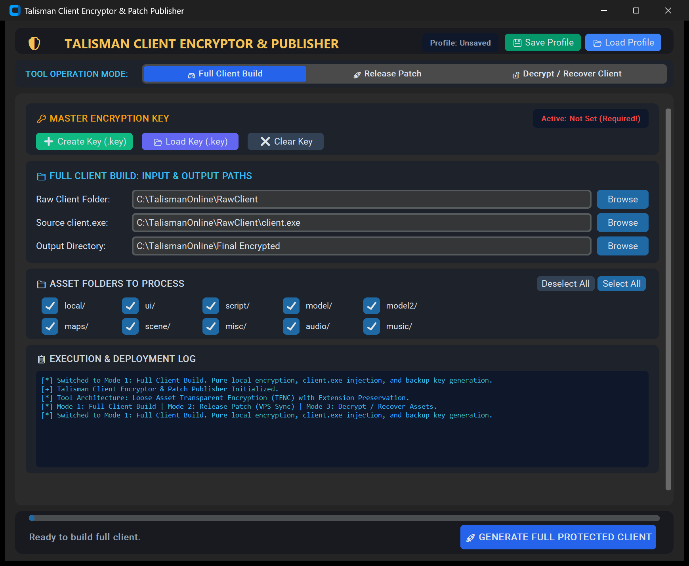
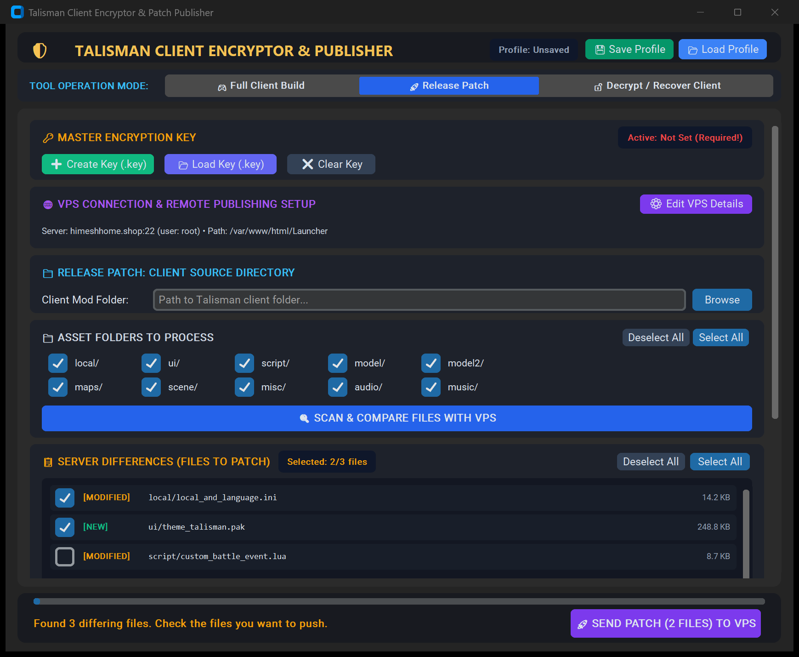
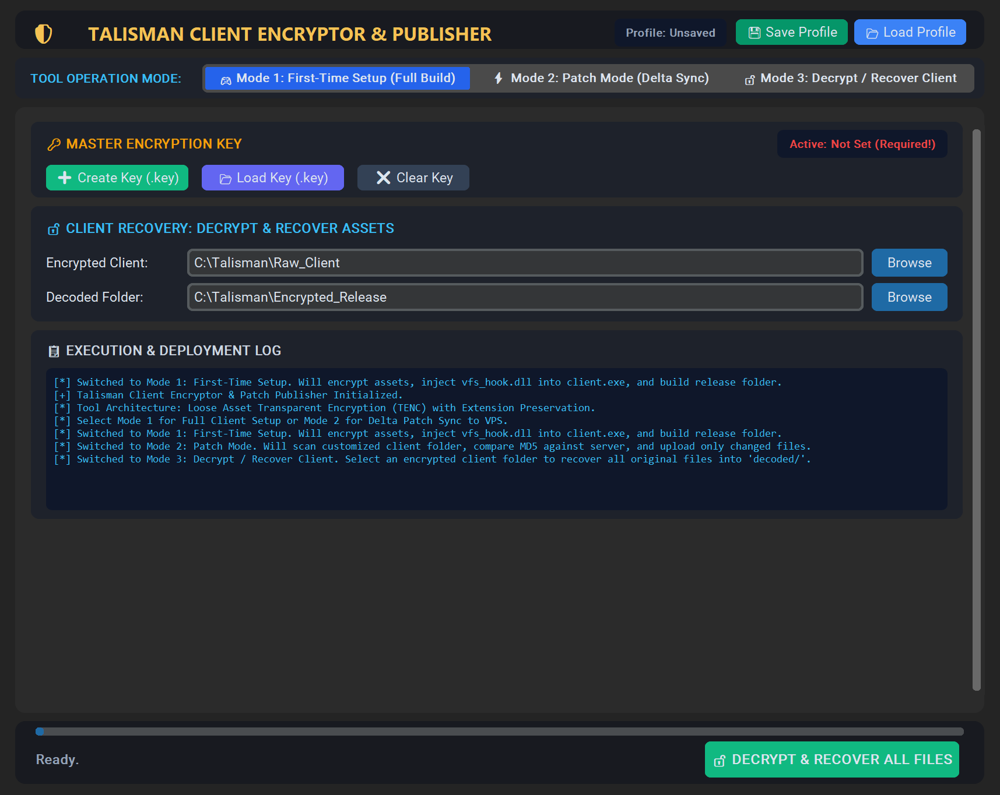
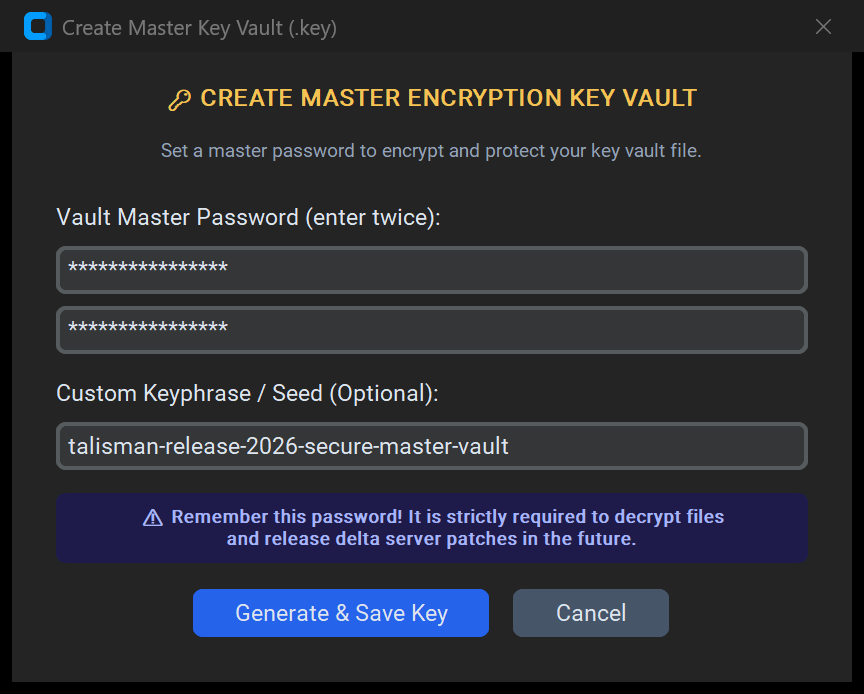
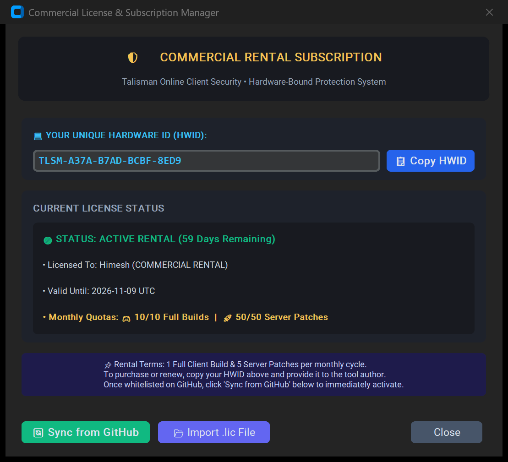

# Talisman Client Encryptor & Patch Publisher

**A professional client encryption suite, transparent Virtual File System (VFS), automated PE import table injector, and remote delta patch publisher for Talisman Online / Warriors of World.**

[📥 Download Executable](#-download-standalone-executable) • [🛡️ License & Activation](#-commercial-license--activation-guide) • [🚀 Step-by-Step Tutorial](#-step-by-step-tutorial-guide) • [💬 Contact on Facebook](https://fb.me/darkscorpiont)

---

## 🌟 Overview & Capabilities

The **Talisman Client Encryptor** completely eliminates legacy, corruptible `.pak` monolithic archives in favor of **Per-File Compressed & Encrypted Loose Assets with Extension Preservation**.

- 🎮 **Full Client Protection & Transparent Decryption**: Assets remain 100% encrypted on disk (`local/`, `ui/`, `model/`, `scene/`, `script/`, `audio/`, etc.) and are decrypted transparently in memory at runtime with zero unencrypted bytes written to disk.
- ⚡ **Automated PE Injection**: Integrates client runtime hooks directly into `client.exe` automatically without requiring third-party PE editors or manual hex editing.
- 🚀 **1-Click Remote VPS Delta Sync**: Compares your local modified assets directly against remote server MD5 checksums over SFTP, displays an interactive checklist of modified files, uploads only the changes, and automatically rebuilds the server launcher patch database.
- 🔓 **Lossless Client Asset Recovery**: Built-in recovery tool restores all encrypted assets back into pure, uncompressed original files and unhooks the client binary for direct standalone testing.
- 🔑 **Hardware-Bound Rental Licensing**: Protected with Ed25519 digital signatures tied to individual machine hardware IDs with automatic cloud whitelist synchronization.

---

## 📸 Tool Screenshots

### Mode 1: Full Client Build
Encrypts all selected asset folders, injects the runtime hook into `client.exe`, embeds the Master Key vault, and generates fast verification cache.

---

### Mode 2: Release Patch (Remote Delta Server Sync)
Scans modified files against remote server checksums via SFTP, displays changed files, and allows selective 1-click publishing.

---

### Mode 3: Decrypt / Recover Client Assets
Restores all encrypted assets back into uncompressed original format and automatically restores `client.exe` for direct launching.

---

### Master Key Vault Creation
Creates a password-protected key vault with optional custom seed phrases and automated backup generation.

---

### Commercial License & Hardware Activation
Allows client subscription management, HWID copying, automated GitHub whitelist syncing, and offline `.lic` import.

---

## 📥 Download Standalone Executable

The tool is distributed as a portable, standalone single-file Windows executable (no Python installation required):

- **Direct Download**: [**📥 Download Talisman Client Encryptor.exe**](Talisman%20Client%20Encryptor.exe)
- **Included Runtimes**: Embedded 32-bit runtime hooks, cryptography modules, and dark GUI theme.

---

## 🛡️ Commercial License & Activation Guide

The application operates on a hardware-bound rental license model. Follow these steps to activate your workstation:

### 1. Get Your Machine Hardware ID (HWID)
1. Run `Talisman Client Encryptor.exe`.
2. Look at the top subscription bar or click **📋 Copy HWID**.
3. Send your copied Hardware ID (`TLSM-XXXX-XXXX-XXXX-XXXX`) to the developer on Facebook for activation:  
   👉 **[fb.me/darkscorpiont](https://fb.me/darkscorpiont)**

### 2. Automatic Cloud Activation (Zero Configuration)
* Once the administrator whitelists your Hardware ID on this repository, simply open the tool while connected to the internet.
* The software will automatically verify your license in the background, display **`🟢 ACTIVE RENTAL`**, and unlock Full Client Build and Release Patch features.

### 3. Manual Offline Activation
* If you received an offline signed license file (`.lic`):
  1. Click **🛡️ License Manager** on the top header.
  2. Click **📂 Import Signed License (.lic)** and select your file.
  3. Your subscription will activate instantly with no internet connection required.

---

## 🚀 Step-by-Step Tutorial Guide

### Step 1: Launch & Verify Subscription
1. Launch `Talisman Client Encryptor.exe`.
2. Confirm the top status badge displays **`🟢 ACTIVE RENTAL`** with your allowed monthly builds and delta patch quotas.

### Step 2: Set Up or Load Your Master Key Vault (.key)
> [!IMPORTANT]  
> The tool requires an active Key Vault before encrypting to ensure you can always update, patch, and recover your assets in the future.

1. In the **Master Encryption Key** section:
   - Click **➕ Create Key (.key)** to generate a new key vault. Enter a strong password (twice) and save the `.key` file.
   - Or click **📂 Load Key (.key)** to unlock an existing vault.
2. Keep your password and key file safe. The tool will also place an emergency backup copy inside your output client folder.

### Step 3: Mode 1 — Build a Full Protected Client
1. Select **🎮 Full Client Build** from the top mode switcher.
2. **Raw Client Folder**: Browse and select your unencrypted game client folder.
3. **Source client.exe**: Select your 32-bit `client.exe` (automatically detected if inside the folder).
4. **Output Directory**: Choose the folder where the protected game client will be built (e.g. `Protected_Client/`).
5. **Asset Folders**: Check all asset directories you wish to protect (`local`, `ui`, `model`, `model2`, `maps`, `scene`, `script`, `misc`, `audio`, `music`).
6. Click **🚀 GENERATE FULL PROTECTED CLIENT**.
7. The tool will encrypt the assets, inject `client.exe`, embed the vault, generate the instant verification cache, and drop emergency key backup files into the folder.

### Step 4: Mode 2 — Release Patch (VPS Sync & Selective Push)
1. Select **🚀 Release Patch** from the top mode switcher.
2. Click **⚙️ Edit VPS Details** and configure your server IP/host, SSH port (22), username, password, and remote launcher path (e.g. `/var/www/html/Launcher`).
3. **Client Mod Folder**: Select your local folder containing newly updated or modified game files.
4. Click **🔍 SCAN & COMPARE FILES WITH VPS**.
5. The engine queries the remote server, compares local file hashes against VPS checksums, and displays an interactive list of all differing files (`[MODIFIED]` or `[NEW]`).
6. Use the checkboxes to select or ignore specific files.
7. Click **🚀 SEND PATCH TO VPS**.
8. Only selected files are encrypted and uploaded via SFTP, and the remote launcher database is automatically rebuilt.

### Step 5: Mode 3 — Decrypt & Recover Client Assets
1. Select **🔓 Decrypt / Recover Client** from the top mode switcher.
2. Select the encrypted client folder and choose an output folder (e.g. `Decoded_Client/`).
3. Ensure your Key Vault is loaded, or let the tool automatically read the embedded key from the client.
4. Click **🔓 DECRYPT & RECOVER ALL FILES**.
5. All encrypted assets are decrypted and restored to original files. The tool also automatically unhooks `client.exe` so you can launch and test the decrypted client directly.

---

## 💬 Activation, Support & Licensing

- **Developer & License Activation**: [**fb.me/darkscorpiont**](https://fb.me/darkscorpiont)
- **Terms**: Commercial Rental Software. All rights reserved.  
  Unauthorized redistribution or sharing of issued commercial licenses is strictly prohibited.
